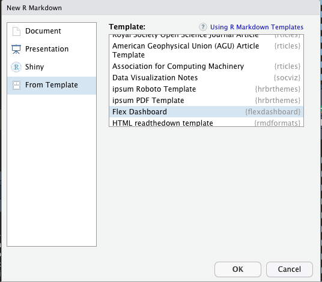
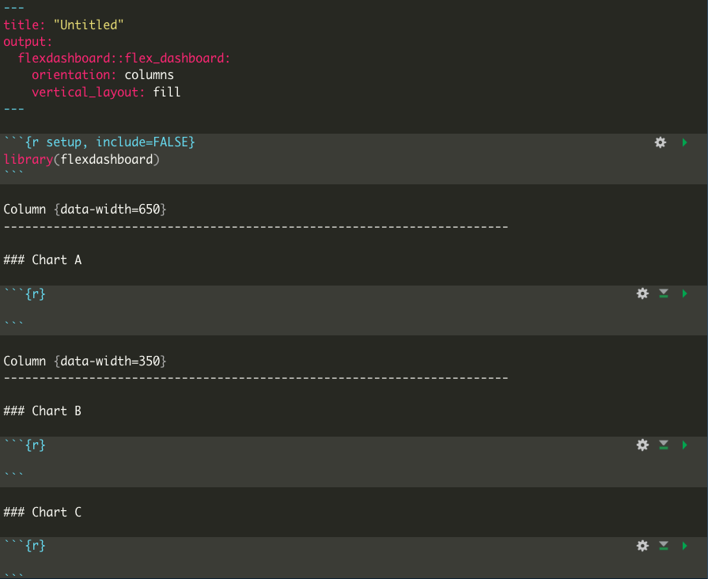
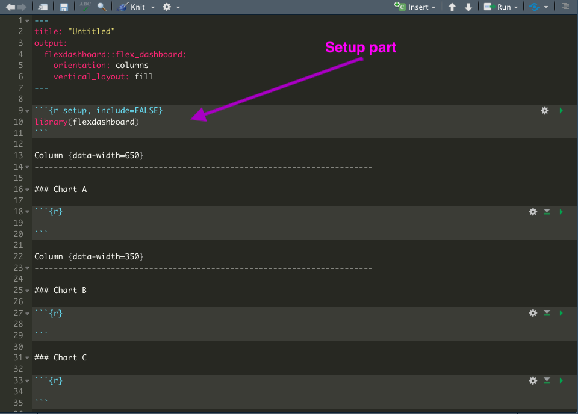
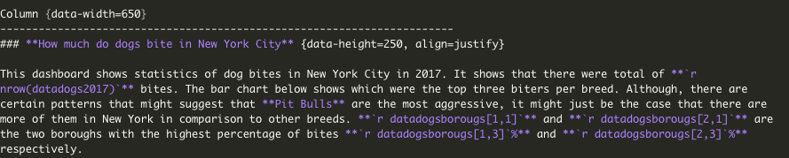
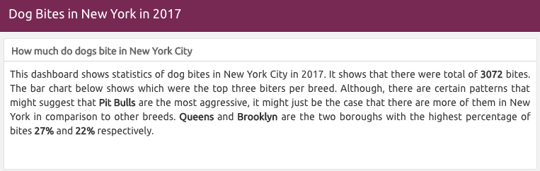
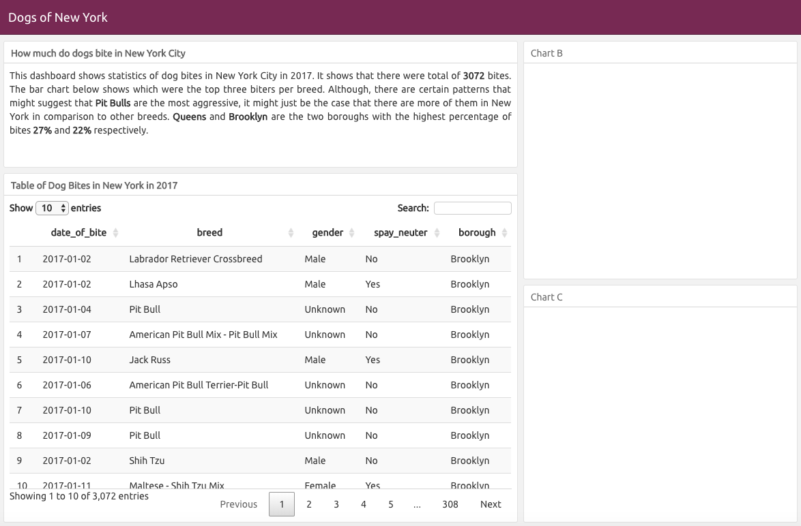
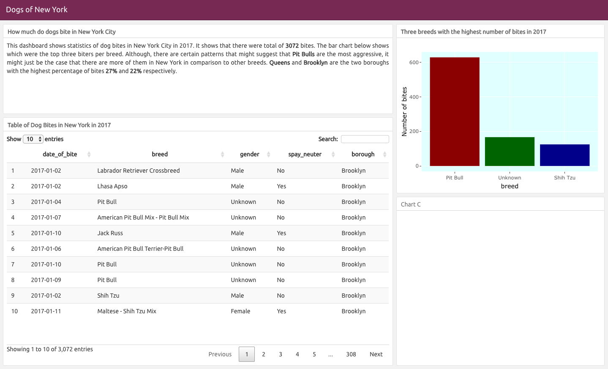
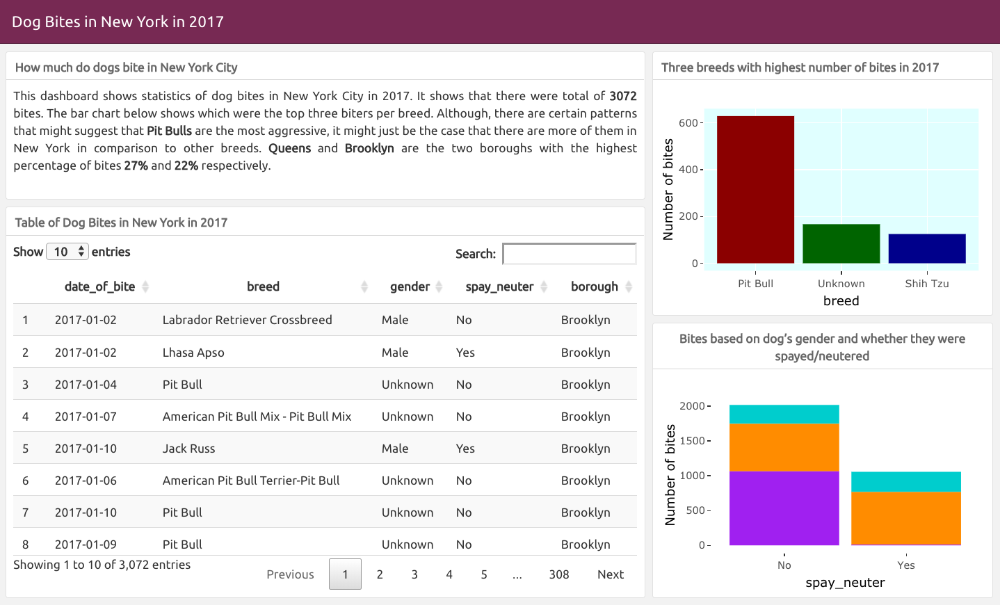

## **Dog Bites in New York Dataset Exercise** 
 <center> Tijana Blagojev - R-Ladies Belgrade </center>


<style type="text/css">
  .reveal p {
    text-align: justify;
  }
  .reveal ul {
    display: block;
  }
  .reveal ol {
    display: block;
  }
  
</style>

<section>
    
</section>

## Aim of the Exercise

- We will get acquainted with how R is functioning

- We will learn about different types of variables 

- We will just scratch a surface of several R packages like parts of tidyverse (dplyr and ggplot)

- We will create a dashboard with information contained in dog bites dataset

## Exercise{align=right}

- Go to this link to download folder with this excercise:
 https://github.com/tixwitchy/Dogs-of-New-York 

- Open **DogsofNewYork.Rproj** file

- Find the step-by-atep instruction at this web address: 
https://tixwitchy.github.io/Dogs-of-New-York/Testhtmlpres.html#/

## First steps

- After installing R and R studio you need to **set a working directory** where all your work will be stored.

- The best way to do this is to choose **File/New Project** which will automatically store all your information in same place.

- As we already opened  **DogsofNewYork.Rproj** file it has already set the working directory for us.


## R Interface 

<section>
    
</section>

## Packages and Libraries 

When you install R, you have basic functions already available within Base R. You can take a look at [Introduction to Base R](https://tanjakec.github.io/blog/introduction-to-r/) for additional information.

However, in order to access functions or data written by other people there are numerious R packages available. 

An **R package** is a bundle of functions (code), data, documentation, vignettes (examples).

**Important note** - R is **case-sensitive** so make sure to check spelling and capitalization!

## Packages and Libraries-Code

To access information in R packages they first need to be installed and then accessed through their libraries. Use the following code to install packages  and load libraries. 


```{r eval=FALSE, message=FALSE}

install.packages("flexdashboard")

install.packages("tidyverse")

install.packages("plotly")

install.packages("DT")

```
```{r,message=FALSE}
library (flexdashboard)

library (tidyverse)

library (plotly)

```


## Simple use of R

Type in your console the following command and press enter.

```{r}
2 + 2
```

You use **<-** to create objects in R. It is called an assignement operator.

```{r}
x <- 5
y <- 10
z <- x + y
z
```


## Dataset

The data set on dog bites is taken from [R package nycdogs by Kieran Healy](https://kjhealy.github.io/nycdogs/). For our exercise it is adapted only to include year 2017 and several variables. So let us see how the dataset looks like.

**Important note**: You will rarely come accross the dataset that is already prepared for analysis. Usually, you will spend between 50% - 80% of your time on cleaning and preparing data. 

## Importing a dataset

First, we will import and inspect a csv file about dog bites in New York City for 2017 with the following code.
```{r, message=FALSE}

datadogs2017 <- read_csv ("datadogs2017.csv")


```

## Inspecting dataset

There are 3072 rows that we will refer to observations and 6 columns that we will call variables. As you may also see, we have different types of variables such as character, date, double (continuous).
```{r}
glimpse (datadogs2017)
```


## Variables

**Measured** have the resulting outcome expressed in numerical terms (Numeric):

- **Integer**: Age, number of kittens

- **Double (Continuous)**: Height, weight

**Attribute** have their outcomes described in terms of their characteristics or attributes:

- **Character**: Black, yellow, white

- **Factor (Ordinal)**: Cold, mild, warm, hot


## Creating R markdown dashboard presentation 
In top left corner press a document with the plus sign icon and choose R Markdown. Then open Flex Dashboard template.

## Creating R markdown dashboard presentation 

<section>
    
</section>

## Flexdashboard Template 
<section>

</section>
## Setting up the Appearance of Flexdashboard 
```{r,eval=FALSE}
---
title: "Dog Bites in New York in 2017"
output: 
  flexdashboard::flex_dashboard:
    orientation: columns
    vertical_layout: fill
    theme: united
---
```


## Pipe operator 

In tidyverse package there is a so-called "pipe" operator **%>%**. It passes the result of the left hand-side as the first operator argument of the function on the right handside. It is used to connect multiple operations on data together.

## Setup part of the R-markdown-Dashboard Document

In the **Setup part** code, we will import a dog bites data  set and create a subset for number of bites per boroughs that we will use in textual part of our dashboard.

```{r, eval=FALSE}
datadogs2017 <- read_csv ("datadogs2017.csv")
```
```{r}
datadogsborougs <- datadogs2017 %>%
  
  group_by (borough) %>%
  
  tally() %>% #  used for counting number of cases
  
  arrange (desc (n)) %>% # new column n (number of bites) arrange in descending order
  
  mutate (perc = round ((n/sum(n)) * 100, 0)) # adding new column for percentage called perc
```

## Setup part of the R-markdown-Dashboard Document

<section>

</section>


## Number of Bites per Borough in New York

Now let us take a look at the 5 boroughs with the highest number of bites

```{r}
head (datadogsborougs, 5)
```

## Textual part of the dashboard 

We will use tick **`**, followed by **r** and some function and closed with another tick as a formula that will automatically add information in the text, so if we use a subset for another year it will update the data in the text straight away. To access particular value in a dataset you can use the following code where the first number is the number of row and the second one the number of column.
```{r}
datadogsborougs[1, 1]
```

## Textual part of the dashboard-Code
```{r, eval=FALSE}

### **How much do dogs bite in New York City** {data-height=250, align=justify}

This dashboard shows statistics of dog bites in New York City in 2017. It shows that there were total of 
**`r nrow(datadogs2017)`** bites.The bar chart below shows which were the top three biters per breed. 
Although, there are certain patterns that might suggest that **Pit Bulls**are the most aggressive, it might
just be the case that there are more of them in New York in comparison to other breeds. 
**`r datadogsborougs[1,1]`** and **`r datadogsborougs[2,1]`** are the two boroughs with 
the highest percentage of bites **`r datadogsborougs[1,3]`%** 
and **`r datadogsborougs[2,3]`%** respectively.

### **Table of Dog Bites in New York in 2017** {data-height=750}

```

## Textual part of the dashboard result {data-background-size=40% }
<section>
    
    
</section>
## Congratulations you just coded and knitted your first dashboard!!!
<section>

</section>
## Creating a Searchable Datatable

First, in a Setup part of our dashboard document we will create a table without last column related to zip codes.
```{r}
datadogstable <- datadogs2017 %>%
  select (-zip_code)
```

Now we will add a searchable table just below the title **Table of Dog Bites in New York in 2017** with the help of DT package. 
```{r, eval=FALSE}
DT :: datatable (datadogstable, options = list(
  bPaginate = TRUE))

```


## Dasboard progress 
<section>

</section>


## Creating a Bar Chart

First, we will create a subset to see which are the three top breed bitters. We will again put this part of code in the first **Setup part** of our R dashboard/R markdown file. 

```{r,message=FALSE}
datadogsbreed <- datadogs2017 %>%
  
  group_by (breed) %>% #grouping by breed variable
  
  tally () %>% #tally will count the number of bites per breed
  
  rename (Number_of_bites = n) %>% #since we got a column entitled "n" we will rename it
  
  arrange (desc (Number_of_bites)) %>% #arranging the breeds in descending order
  
  top_n(3) #choosing only top three breeds


```


## Using ggplot and plotly

We will use two packages, one (ggplot) to make a bar graph and another one (plotly) to make the graph's information pop up when hovering. Ggplot is a package created by [Hadley Wickam](https://resources.rstudio.com/authors/hadley-wickham) that is based on a grammar of graphics. 

## Grammar of Graphics

Enables you to specify building blocks of a plot and to combine them to create graphical display you want. 

- data

- aesthetic mapping

- geometric object

- statistical transformations

- scales

- coordinate system

- position adjustments

- faceting


## Creating bar graph

Instead of  Chart B we will write: **Three breeds with the highest number of bites in 2017** and use this a code for a bar chart.

```{r, eval=FALSE}

p <- ggplot (data = datadogsbreed) +  #data  mapping
  
     geom_col (aes (x = breed, y = Number_of_bites),#geometric object and aesthetic mapping we will reorder breed based on number of bites in descending order
               fill = c("darkred", "darkgreen", "darkblue")) +     #with colors for bars
     xlab ("Breed") + 
     ylab ("Number of Bites") +   #adding the title of y lab
  
     theme (legend.position = "none",
            
          panel.background = element_rect (fill = "lightcyan"))  #removing legend and changing panelbackground color

#Turn it interactive with plotly
p <- ggplotly (p)
p

```

## Bar Chart 
As you can see the order of bars is not quite right. 
<style> div[id*="htmlwidget"] { margin: auto; } </style>
```{r,echo=FALSE}
p <- ggplot (data = datadogsbreed) +     #data and aesthetic mapping
  
     geom_col (aes (x = breed,y = Number_of_bites), fill = c("darkred", "darkgreen", "darkblue")) + #geometric object
  
     ylab ("Number of bites") +           #adding the title of y lab
  
     theme (legend.position = "none",
            
          panel.background = element_rect (fill = "lightcyan"))

p <- ggplotly (p)

p

```

## Changing Character Variable to a Factor

We will add in the **Setup part** of our file the following code that will transform character variable-**breed** to a factor. We will specify levels so that we can create a proper order of dog breeds according to the number of bites - first level will be Pit Bull, followed by Unknown and then Shih Tzu. 

Note: In order to use a particular column/variable in R, we connect dataset and needed column with the dollar sign.

```{r}
# Changing order of levels to be presented on the graph properly 

datadogsbreed$breed <- factor (datadogsbreed$breed,
                               levels = c ("Pit Bull", "Unknown", "Shih Tzu"))
```


## Dashboard Progress 
<section>

</section>

## Final Stage - Braaavoo!!!!
<section>

</section>

## Stacked Bar of Spayed/Neutered Dogs

In this final part, we will create a stacked bar chart which will show how many dogs that bit were spayed/neutered and how many of them were male or female. So we will again in **Setup part** create a subset grouped by spay/neuter and gender. We will also create another column to use it as a pop-up label.
```{r}
datadogsgenderspay <- datadogs2017 %>%
  
  group_by (spay_neuter, gender) %>% 
  
  tally () %>%                                          #counting number of cases of these two groups
  
  mutate (Info = paste ('<br>', "Spay/Neuter:",         #"<br>" is used to indicate break/next line
                        
                        spay_neuter, '<br>',
                        
                        "Number of bites:", n, '<br>',
                        
                        "Gender:", gender, '<br>'))     # Creating new variable- Info to be used as a label 
```

## The datadogsgenderspay subset 

```{r, echo=FALSE}

kableExtra:: kable(datadogsgenderspay)

```

## Creating stacked bar graph

Instead of  Chart C we will write and center the title: **Bites based on dog's gender and whether they were spayed/neutered** {align=center} and use this a code for a stacked bar:
```{r,eval=FALSE,warning=FALSE}
p1<- ggplot (data = datadogsgenderspay)+ #data mapping
  
  geom_col (aes (x = spay_neuter, y = n,  #geom object and aesthetic mapping
                 
                 fill = gender, label = Info)) + #creating stack by gender and using Info column as label
  
  scale_fill_manual (values = c('cyan3', 'darkorange', "purple")) + #using specific colours for gender
  
  ylab ("Number of bites") +
  
  theme (legend.position = "none",
    panel.background = element_blank())

p1<-ggplotly(p1, tooltip = "Info") # adding in plotly label Info
p1
```

## Stacked Bar

```{r,echo=FALSE,warning=FALSE}
p1<- ggplot (data = datadogsgenderspay)+
  
  geom_col (aes (x = spay_neuter, y = n, fill = gender, label = Info)) +
  
  scale_fill_manual (values = c('cyan3', 'darkorange', "purple")) +
  
  ylab ("Number of bites") +
  
  theme (legend.position = "none",
    panel.background = element_blank())


p1<-ggplotly(p1, tooltip = "Info")

p1
```

## Dashboard Completed 
<section>

</section>

## Word of Caution in this Tale

> *"We infer that something we see in the data applies beyond the time, place and conditions in which it happened to surface."* 
>
> --- Ben Jones, Avoiding Data Pitfalls


## Word of Caution in this Tale

- In order to say that **Pit Bulls** are really agressive we need to do additional research.

- Is it relevant to make conclusions with this number of observations? Is the data reliable?

- That is why experts need to be able to create this type of visualisations. They already have expertise needed to draw valid conclusion and this tool can help them reach wider audience as well as follow and contribute to other people's work.

## Great Work and Thank you!
<section>

</section>
